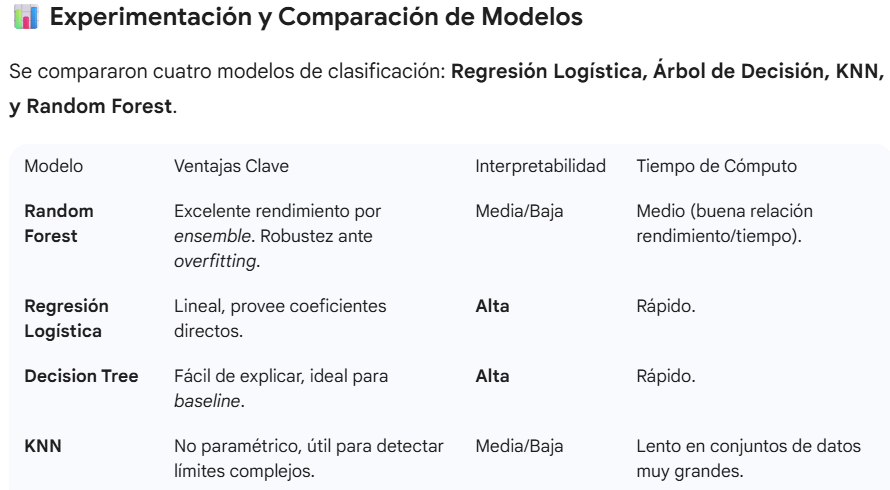

#  ARQUITECTURA MODULAR DE MACHINE LEARNING

## Proyecto: Pipeline (Actividad 2)
### Autor: Juan Carlos Campos Herrera
### Docente: IVAN ALEJANDRO TOLEDANO JUAREZ
### Repositorio de Referencia: [IvTole/Topicos_II](https://github.com/IvTole/Topicos_II)

---

## 🎯 Objetivo del Proyecto

Implementar una arquitectura de Machine Learning **modular y reproducible** para el reto WIDS Datathon 2024 (diagnóstico temprano de cáncer de mama). Se prioriza la separación de responsabilidades y el **tracking de experimentos** mediante la herramienta **MLflow**.

## 🛠️ Requisitos del Entorno

Para ejecutar el pipeline, instale las librerías necesarias:

pip install pandas numpy scikit-learn mlflow tabulate

**Estructura del Repositorio**
El proyecto se estructura con los siguientes módulos, garantizando la modularidad y la reutilización del código:

main.py	Orquestador Principal: Ejecuta el flujo completo (carga, preprocesamiento, entrenamiento).	Separación clara de responsabilidades.

src/module_data.py	Módulo de Datos: Carga, imputación, escalado (StandardScaler), codificación (OneHotEncoder) y división de datos.	Reutilización de transformaciones.

src/module_ml.py	Módulo de Modelado: Entrenamiento, cálculo de métricas (Accuracy, ROC-AUC), y registro de experimentos con MLflow.	Centralización de la lógica de experimentación.

data/	Contiene los datasets originales.	Buena práctica de gestión de datos.

mlruns/	Almacena todos los logs y modelos registrados por MLflow.	Cumplimiento de Tracking.

**Guía de ejecucion**

1. Preparación
Coloque los archivos training.csv y test.csv dentro de la carpeta data/.

2. Ejecución del Pipeline
Ejecute el script principal desde la raíz del repositorio:
python main.py

3. Visualización de Experimentos (MLflow)
Para ver las métricas, parámetros y artefactos (modelos) registrados por cada algoritmo, inicie la interfaz web de MLflow:
mlflow ui

